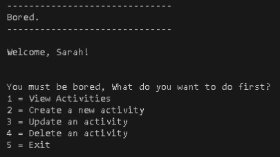

# bored.

A simple Java application to help you banish boredom! `bored.` allows you to create and manage lists of activities to spark your imagination and inspire you to take action when those dull moments strike.

## Key Features

* **Pre-built Templates:** Comes with 4 example activities to get you started.
* **CRUD Operations:** Easily **C**reate, **R**ead, **U**pdate, and **D**elete your boredom-busting activities via a terminal menu.
* **Local Data Storage:** All your activity lists are stored locally using SQLite.

## Installation

To run `bored.` on your local machine, you'll need to have Java installed. Additionally, the project relies on the `sqlite-jdbc` library. Here's how to get everything set up:

1.  **Download the Project:** Clone or download the source code of `bored.` to your local machine.
2.  **Include the SQLite JDBC Driver:**
    * Download the `sqlite-jdbc-3.36.0.3.jar` file. You can usually find this on the Maven Central repository or a similar Java dependency repository.
    * Add this `.jar` file to your project's dependencies. The exact method for doing this will depend on your Integrated Development Environment (IDE):
        * **IntelliJ IDEA:** Go to File > Project Structure > Modules > Dependencies. Click the "+" button and select "JARs or directories..." to add the downloaded `.jar` file.
        * **Eclipse:** Right-click on your project in the Project Explorer, go to Build Path > Configure Build Path. In the "Libraries" tab, click "Add External JARs..." and select the downloaded `.jar` file.
        * **Other IDEs:** Consult your IDE's documentation on how to add external JAR files to your project's classpath.

## Usage

Once you have the project set up in your IDE:

1.  **Run the Application:** Click the "debug" or "run" button within your IDE. This will start the Java application.
2.  **Follow the Menu Prompts:** The application runs in your terminal. A menu will be displayed with options to create, read, update, and delete activities. Use your keyboard to navigate the menu and input your choices.

## Technologies Used

* Java
* JDBC (Java Database Connectivity)
* SQLite (for local data storage)
* [SQLite JDBC Driver](https://mvnrepository.com/artifact/org.xerial/sqlite-jdbc/3.36.0.3)

## Contributing

We welcome contributions from the community! Feel free to fork this repository, make your changes, and submit a pull request. Any improvements, bug fixes, or new features are highly appreciated.

## License

This project is licensed under the [MIT License](https://opensource.org/licenses/MIT). This means you are free to use, modify, and distribute the code for both commercial and non-commercial purposes, as long as you include the original copyright and license notice.

## Screenshots
Main Menu

View Activity menu

View indoor activities

View outdoor activities

## Project Status

This project is currently in **demo** mode, showcasing its core functionalities. Further development and enhancements may be on the way.
